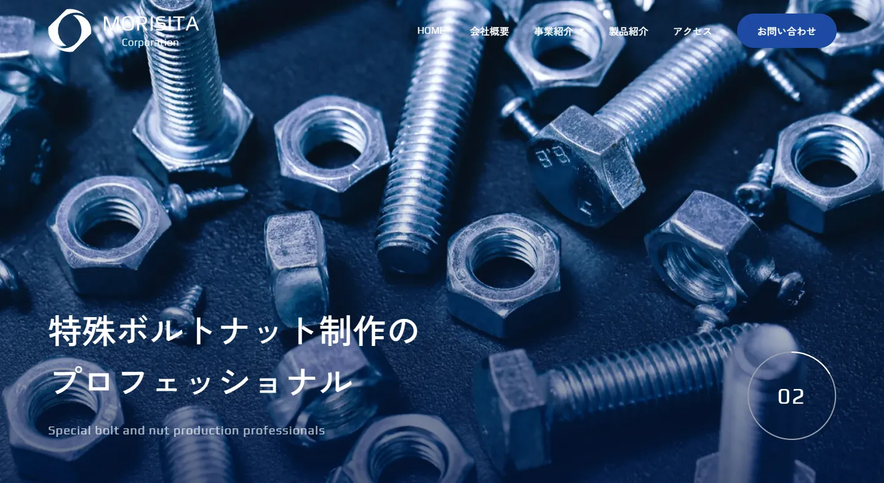

# 🧩 Cafe Site SUPPLE – Web Coding Demo（架空サイト）



## 🔗 Demo

（Demo Site URL）
[https://omi758.github.io/matsuyama-clinic-demo/](https://omi758.github.io/matsuyama-clinic-demo/)

&nbsp;

## 📝 Overview（概要）

HelloMentor 課題として制作した 製造業（ネジ・ボルトの専門メーカー）のコーポレートサイト です。  
**静的コーディングから WordPress オリジナルテーマとして構築**しました。

- 静的コーディング → WordPress テーマ化（PHP）
- WordPress 環境構築（Local）
- カスタム投稿タイプ：product / business / access
- BreadCrumb NavXT を CPT 用にカスタム
- GSAP（ScrollTrigger / SmoothScroll）で動的アニメーション
- Splide + SVG プログレスリング（Web Animation API）
- BEM に基づく CSS 設計 + SCSS 運用による再利用性を重視
- CloudSecure WP Security など実務的なセキュリティプラグインも導入
- 管理画面の利便性（編集項目の最適化・フィールド管理）
- レスポンシブ対応（SP・PC）

&nbsp;

## 🛠️ Tech Stack（使用技術）

<p align="left">


 
 


</p>

&nbsp;

## ✨ Features（制作ポイント）

### 1. WordPress オリジナルテーマとして構築

- テンプレート階層（front-page / archive / single など）に沿って実装
- 製品・事業紹介・アクセスを **CPT** で管理
- ACF による管理画面のフィールド最適化

### 2. Splide + SVG（Web Animation API）を用いたアニメーション実装

- Splide のスライダー機能
- スライド切替に連動する SVG プログレスリングと画像のズーム演出
- CTA 部分は auto-scroll（流れる文字）も実装

### 3. GSAP アニメーション

- ScrollTrigger によるスクロールアニメーション
- SmoothScroll による自然なスクロール
- ハンバーガーメニュー開閉アニメーション

### 4. アクセシビリティを意識した HTML 設計

- header / main / nav / footer など適切な landmark
- aria 属性・alt の適切な付与と **セマンティックで読みやすい HTML 構造** を意識して実装

### 5. CMS（管理画面）の利便性向上

- CPT ごとの編集フィールドを最適化
- ACF（無料版）で運用しやすい UI を構築
- Contact Form 7 / SEO SIMPLE PACK / EWWW Image Optimizer / CloudSecure WP Security 等  
  実務的なプラグインを導入

&nbsp;

## 📂 Directory（主な構成）

```text
.
├── 404.php
├── archive-access.php
├── archive-product.php
├── footer.php
├── front-page.php
├── functions.php
├── header.php
├── index.php
├── page-company.php
├── page-contact.php
├── page-message.php
├── page-privacy.php
├── single-business.php
├── single-product.php
├── single.php
├── style.css
├── css
│   ├── editor-style.css
│   ├── style.css
│   ├── style.css.map
│   └── vendor
│       └── splide-core.min.css
├── img
├── js
│   ├── component
│   │   ├── cta-auto-scroll.js
│   │   ├── hamburger-menu.js
│   │   ├── product-single-gallery.js
│   │   ├── scroll-top-button.js
│   │   ├── switch-viewport.js
│   │   ├── toc-scrolltrigger.js
│   │   ├── top-kv-slider.js
│   │   └── top-product-slider.js
│   ├── main.js
│   └── vendor
│       ├── gsap.min.js
│       ├── ScrollToPlugin.min.js
│       ├── ScrollTrigger.min.js
│       ├── splide-extension-auto-scroll.min.js
│       └── splide.min.js
├── scss
│   ├── component
│   ├── foundation
│   ├── global
│   ├── layout
│   ├── page
│   │   ├── access
│   │   ├── business
│   │   ├── company
│   │   ├── contact
│   │   ├── message
│   │   ├── news
│   │   ├── product
│   │   └── top
│   ├── utility
│   ├── editor-style.scss
│   └── style.scss
└── template-parts
    ├── breadcrumb.php
    ├── loop-business.php
    ├── loop-news.php
    ├── loop-products.php
    ├── sidebar-news.php
    ├── subkv-archive.php
    ├── subkv-single-news.php
    └── subkv-single.php
```

## 💻 Development Environment（開発環境）

- Local by Flywheel（WordPress）
- VSCode / GitHub Copilot / Gemini Code Assist
- SCSS / Live Sass Compiler
- ES Modules
- ホットリロード環境（node_modules / BrowserSync）

&nbsp;

## ⚠️ Notes（注意事項）

- 本テーマは学習用に制作しています。

&nbsp;
